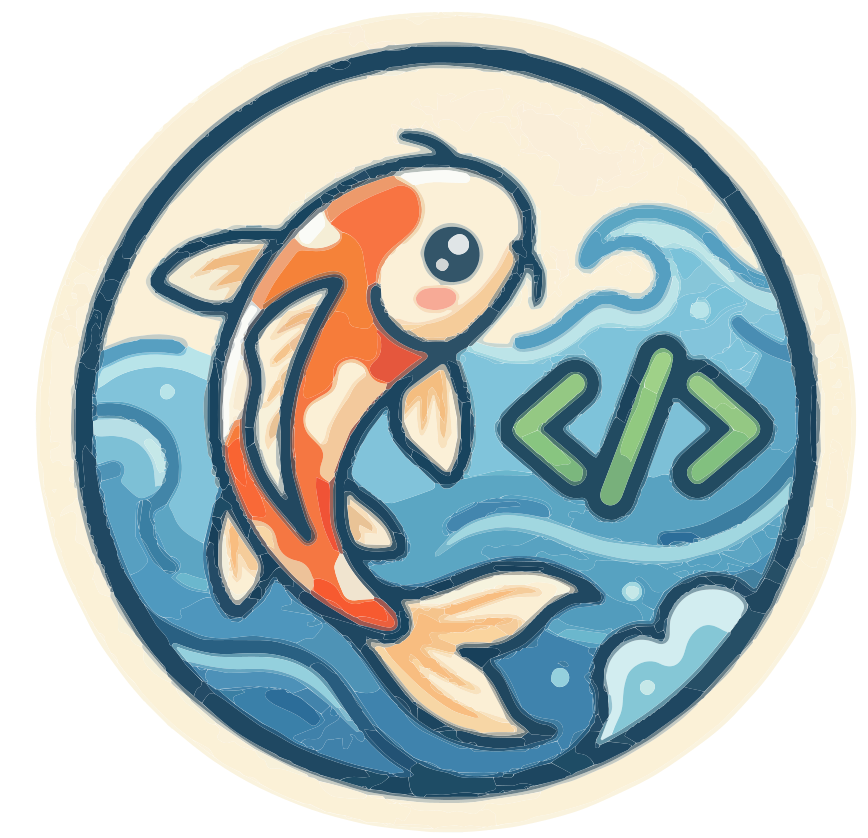

<p align="center">
  
</p>

<h1 align="center">Koi</h1>

<p align="center">
  <strong>The agent operating system.</strong><br/>
  Self-extending agents that are safe by design.
</p>

<p align="center">
  <a href="#quickstart">Quickstart</a> &middot;
  <a href="#why-koi">Why Koi</a> &middot;
  <a href="#architecture">Architecture</a> &middot;
  <a href="#cli">CLI</a> &middot;
  <a href="#admin-panel">Admin Panel</a> &middot;
  <a href="#contributing">Contributing</a>
</p>

---

## Quickstart

> **Pre-release**: Koi is not yet published to npm. The target experience is below — see [Development](#development) for building from source.

```bash
bun add koi
koi init my-agent
cd my-agent
koi start
```

The YAML file **is** the agent:

```yaml
# koi.yaml
name: my-agent
version: 0.1.0
model: "anthropic:claude-haiku-4-5-20251001"
channels:
  - name: "@koi/channel-cli"
tools:
  - name: "@koi/tools-web"
  - name: "@koi/tool-ask-user"
context:
  bootstrap: true
```

Add a channel? One line. Add an MCP server? Two lines. Add budget controls? Three lines.

```yaml
channels:
  - "@koi/channel-telegram": { token: ${TELEGRAM_BOT_TOKEN} }
tools:
  mcp:
    - name: yahoo-finance
      command: "npx yahoo-finance-mcp"
middleware:
  - "@koi/middleware-pay": { budget: { daily: 0.50 } }
```

## Why Koi

**Koi is an agent operating system, not another agent framework.**

| Problem | How Koi solves it |
|---------|-------------------|
| Agents can't build their own tools safely | **Forge**: 4-stage verification (static analysis, sandbox, adversarial probes, trust tiers) |
| Terminal-only | **15 channels**: CLI, Telegram, Slack, Discord, WhatsApp, Voice, Email, Signal, Teams, Matrix, Mobile, AG-UI, Chat SDK, Canvas, Web |
| No undo when agents break things | **Time travel**: rewind, fork, replay from any checkpoint |
| Runaway costs | **Token economics**: cascade routing (Haiku/Sonnet/Opus), budget kill switch, circuit breaker |
| Multi-agent = blind trust | **Governed delegation**: HMAC tokens, monotonic scope attenuation, cascading revocation |
| No observability | **Admin panel**: real-time dashboard with agent status, cost tracking, and event streams ([planned](https://github.com/windoliver/koi/issues/924)) |
| Memory degrades over time | **3-tier memory**: hot (session), warm (cross-session), cold (archival) with consolidation |
| Single-server ceiling | **Federation**: Raft consensus, mDNS discovery, offline queue, edge deployment |
| Every data source is different | **Nexus**: 14 connectors unified under a path API — everything is a file |

## Architecture

Koi uses a strict four-layer architecture. Layer violations are build errors.

```
L0  @koi/core        Interfaces-only kernel. Types + contracts. Zero logic. Zero deps.
L1  @koi/engine       Kernel runtime. Guards, lifecycle, middleware composition.
L2  @koi/*            Feature packages. Each depends on L0 only. Never on L1 or peers.
L3  Meta-packages     Convenience bundles (e.g., @koi/starter = L0 + L1 + selected L2).
L4  koi               Single installable package (planned — not yet published).
```

### 222 packages, 7 contracts

The kernel defines 7 extension contracts:

| Contract | Purpose | Surface |
|----------|---------|---------|
| **Middleware** | Sole interposition layer for model/tool calls | 7 optional hooks |
| **Message** | Inbound/outbound data format | `ContentBlock[]` |
| **Channel** | I/O interface to users | `send()` + `onMessage()` |
| **Resolver** | Discovery of tools/skills/agents | `discover()` + `load()` |
| **Assembly** | What an agent IS (manifest) | Declarative YAML config |
| **Engine** | Swappable agent loop | `stream()` |
| **AgentRegistry** | Agent lifecycle management | CAS transitions + `watch()` |

Plus ECS composition: Agent = entity, Tool = component, Middleware = system.

### Key subsystems

| Subsystem | Packages | What it does |
|-----------|----------|-------------|
| **Forge** | 6 packages | Safe self-extension: demand analysis, verification, crystallization, trust tiers |
| **Governance** | 14 packages | Permissions, audit, budget, delegation, graduated sanctions, intent capsules |
| **Channels** | 14 adapters | Every surface from CLI to Voice to AG-UI |
| **Middleware** | 21 packages | Interposition for memory, retry, pay, PII, sandbox, permissions, and more |
| **Engines** | 6 adapters | Pi (primary), Claude SDK, ReAct loop, external process, ACP, RLM |
| **Sandbox** | 9 packages | Docker, E2B, Wasm, Cloudflare Workers, Vercel, Daytona, OS sandbox, and more |
| **Nexus** | 14 connectors | Gmail, Calendar, Drive, Slack, GitHub, S3, PostgreSQL, and more as file paths |
| **IPC** | 8 packages | Gateway, Node, mDNS, task board, agent spawner, federation |
| **Observability** | 11 packages | Dashboard, eval, tracing, monitoring, debug — real-time admin panel with SSE |

## CLI

```
koi init [directory]     Create a new agent
koi start [manifest]     Start agent interactively (REPL)
koi serve [manifest]     Run agent headless (for services)
koi deploy [manifest]    Install as OS service (launchd/systemd)
koi status [manifest]    Check service status
koi stop [manifest]      Stop the service
koi logs [manifest]      View service logs
koi doctor [manifest]    Diagnose service health
```

### `koi init`

Scaffolds a new agent project with interactive wizard or `--yes` for defaults.

```bash
koi init my-agent --template minimal --model anthropic:claude-haiku-4-5-20251001
```

### `koi start`

Runs an agent interactively with CLI channel for REPL.

```bash
koi start                     # uses ./koi.yaml
koi start ./agents/copilot.yaml --verbose
```

### `koi serve`

Headless mode for production services. HTTP health server, graceful shutdown, conversation persistence.

```bash
koi serve --port 9100 --nexus-url https://nexus.example.com
```

### `koi deploy`

Install as a background OS service with automatic restart.

```bash
koi deploy                     # user service (launchd on macOS, systemd on Linux)
koi deploy --system            # system-wide service
koi deploy --uninstall         # remove the service
```

## Admin Panel

> **Status**: The dashboard packages (`@koi/dashboard-ui`, `@koi/dashboard-api`, `@koi/dashboard-types`) exist. CLI integration (`koi serve --admin`, `koi admin`) is tracked in [#924](https://github.com/windoliver/koi/issues/924).

A browser-based UI for managing running agents, built on React 19 + Vite.

**Core views:**
- Agent status, tool inventory, cost tracking, audit log
- Nexus file browser (everything-is-a-file namespace tree)
- Real-time SSE event stream
- Runtime views: process tree, middleware chain, gateway topology
- Commands: suspend, resume, terminate agents; retry dead-letter queue

**Planned — orchestration overlay** ([#924](https://github.com/windoliver/koi/issues/924)):
- Temporal workflows, scheduler kanban, task board DAG, harness checkpoints

**Planned — interactive console** ([#933](https://github.com/windoliver/koi/issues/933)):
- Create/dispatch agents from the browser, chat via AG-UI streaming

## Manifest

The `koi.yaml` manifest defines everything about an agent declaratively.

```yaml
name: daily-briefer
version: 0.1.0
model: "anthropic:claude-haiku-4-5-20251001"

# Nexus: auto-starts locally in embed mode (SQLite + filesystem).
# Set nexus.url for remote/shared Nexus.
# nexus:
#   url: https://nexus.example.com

channels:
  - name: "@koi/channel-cli"
  - "@koi/channel-telegram": { token: ${TELEGRAM_BOT_TOKEN} }

tools:
  koi:
    - name: "@koi/tools-web"
    - name: "@koi/tool-ask-user"
  mcp:
    - name: reddit
      command: "npx reddit-mcp-server"

middleware:
  - "@koi/middleware-hot-memory": {}
  - "@koi/middleware-pay": { budget: { daily: 0.50 } }
  - "@koi/middleware-permissions": { default: ask }

forge:
  enabled: true
  maxForgesPerSession: 5

schedule: "0 7 * * *"

soul: "./soul.md"

context:
  bootstrap: true
  sources:
    - kind: text
      text: "You are a concise personal assistant."
    - kind: memory
      query: "user preferences"
```

## MCP Servers

Any MCP server works as a plug-and-play tool. Declare it in `koi.yaml`:

```yaml
tools:
  mcp:
    - name: yahoo-finance
      command: "npx yahoo-finance-mcp"
    - name: homeassistant
      command: "npx homeassistant-mcp"
    - name: playwright
      command: "npx @anthropic/mcp-server-playwright"
```

The same MCP servers work in Claude Desktop, Cursor, VS Code, and Koi.

## Toolchain

| Tool | Choice |
|------|--------|
| Runtime | Bun 1.3.x |
| Package manager | `bun install` |
| Test runner | `bun:test` |
| Build | tsup (ESM-only, `.d.ts`) |
| Orchestration | Turborepo |
| Lint/Format | Biome |

## Development

```bash
git clone https://github.com/windoliver/koi.git
cd koi
bun install
bun run build
```

### Running an agent from source

After building, use the CLI via turbo:

```bash
# Scaffold a new agent
bunx turbo run build --filter=@koi/cli
bun packages/meta/cli/dist/bin.js init my-agent

# Start the agent
cd my-agent
bun ../packages/meta/cli/dist/bin.js start
```

Or write a minimal script directly against the API:

```typescript
// run.ts
import { loadManifest } from "@koi/manifest";
import { createPiAdapter } from "@koi/engine-pi";
import { createKoi } from "@koi/engine";

const { manifest } = (await loadManifest("./koi.yaml")).value;
const adapter = createPiAdapter({ model: manifest.model.name });
const { runtime } = await createKoi({ manifest, adapter });

for await (const event of runtime.run({ kind: "text", text: "Hello!" })) {
  if (event.kind === "text_delta") process.stdout.write(event.delta);
}
```

### Running tests

```bash
bun test                    # all tests
bun test --filter @koi/core # single package
```

## Contributing

Contributions welcome. Please read the project's `CLAUDE.md` for coding standards, architecture rules, and the anti-leak checklist before submitting PRs.

Key rules:
- `@koi/core` (L0) has zero runtime code — types and interfaces only
- L2 packages import from L0 only — never from L1 or peer L2
- All interface properties are `readonly`
- No vendor types in L0 or L1
- PRs under 300 lines of logic changes
- 80% test coverage minimum

## License

See [LICENSE](LICENSE) for details.
